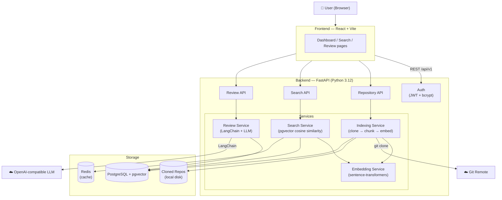

# AI Code Review & Repository Intelligence Platform

A full-stack platform that indexes Git repositories, performs semantic code search using vector embeddings, and generates AI-powered code review suggestions via an OpenAI-compatible LLM.

---

## Architecture



---

## Folder Structure

```
.
├── backend/
│   ├── api/
│   │   ├── dependencies.py       # FastAPI dependency factories
│   │   └── routes/
│   │       ├── auth.py           # /auth — register, login, me
│   │       ├── repositories.py   # /repositories — CRUD + reindex
│   │       ├── search.py         # /search — semantic search
│   │       └── reviews.py        # /reviews — file & repo AI review
│   ├── auth/                     # JWT, bcrypt, RBAC
│   ├── config/                   # Pydantic settings (reads .env)
│   ├── database/                 # Async SQLAlchemy engine + session
│   ├── models/                   # ORM: User, Repository, RepoFile, CodeChunk, ReviewHistory
│   ├── schemas/                  # Pydantic v2 request/response models
│   ├── services/
│   │   ├── embedding_service.py  # sentence-transformers
│   │   ├── indexing_service.py   # clone → chunk → embed → store
│   │   ├── repository_service.py # CRUD helpers
│   │   ├── search_service.py     # pgvector ANN search + caching
│   │   └── review_service.py     # LangChain LLM review pipeline
│   ├── utils/                    # git, file chunking, cache, logging
│   ├── alembic/                  # DB migrations
│   ├── tests/                    # pytest-asyncio test suite
│   └── main.py                   # FastAPI app entry point
│
├── frontend/
│   └── src/
│       ├── api/                  # Axios modules (auth, repos, search, reviews)
│       ├── components/           # Navbar, StatusBadge, SeverityBadge, ProtectedRoute
│       ├── context/              # AuthContext + useAuth hook
│       ├── pages/                # Login, Register, Dashboard, Repositories, Search, Reviews
│       └── types/                # TypeScript interfaces
│
├── docker/
│   ├── Dockerfile.backend
│   ├── Dockerfile.frontend
│   └── nginx.conf
│
├── .github/workflows/
│   ├── ci.yml                    # Lint, type check, test on every push/PR
│   └── deploy.yml                # Build → ECR → ECS on merge to main
│
├── docs/
│   └── ecs-task-definition.json  # Sample AWS ECS task definition
│
├── docker-compose.yml
└── .env.example
```

---

## Tech Stack

| Layer | Technology |
|---|---|
| Backend | Python 3.12, FastAPI, SQLAlchemy 2 (async), Alembic |
| Database | PostgreSQL 16 + pgvector |
| Cache | Redis (in-memory fallback for development) |
| Embeddings | `sentence-transformers` — `all-MiniLM-L6-v2` (384-dim) |
| LLM | LangChain + OpenAI-compatible API |
| Auth | JWT (python-jose) + bcrypt (passlib) |
| Frontend | React 18, Vite, TypeScript, Axios, React Router |
| Deployment | Docker, Docker Compose, GitHub Actions, AWS ECS Fargate |

---

## Getting Started

### Prerequisites

- Docker & Docker Compose
- Git

### 1. Clone the repository

```bash
git clone https://github.com/your-username/ai-code-review-platform.git
cd ai-code-review-platform
```

### 2. Configure environment variables

```bash
cp .env.example .env
```

Edit `.env` and set at minimum:

```env
SECRET_KEY=your-long-random-secret
OPENAI_API_KEY=sk-...
```

### 3. Start all services

```bash
docker compose up --build
```

This will:
1. Start PostgreSQL (with pgvector) and Redis
2. Run Alembic migrations automatically
3. Start the FastAPI backend on **port 8000**
4. Build and serve the React frontend on **port 3000**

### 4. Open the app

| Service | URL |
|---|---|
| Frontend dashboard | http://localhost:3000 |
| Backend API docs | http://localhost:8000/docs |
| Health check | http://localhost:8000/health |

---

## Running Locally (without Docker)

### Backend

```bash
# Create virtual environment
python -m venv .venv
source .venv/bin/activate

# Install dependencies
pip install -r backend/requirements-dev.txt

# Copy and edit env
cp .env.example .env

# Run migrations (requires a running PostgreSQL with pgvector)
alembic -c backend/alembic.ini upgrade head

# Start the server
uvicorn backend.main:app --reload --port 8000
```

### Frontend

```bash
cd frontend
npm install
npm run dev        # starts on http://localhost:5173
```

The Vite dev server proxies `/api/*` to `http://localhost:8000`.

---

## Running Tests

```bash
pip install -r backend/requirements-dev.txt aiosqlite
pytest -q
```

Tests use an in-memory SQLite database — no PostgreSQL required.

---

## API Overview

All endpoints are prefixed with `/api/v1`.

### Auth

| Method | Endpoint | Description |
|---|---|---|
| `POST` | `/auth/register` | Create a new user account |
| `POST` | `/auth/login` | Returns a JWT access token |
| `GET` | `/auth/me` | Returns the current user profile |

### Repositories

| Method | Endpoint | Description |
|---|---|---|
| `POST` | `/repositories/` | Add a repository (kicks off background indexing) |
| `GET` | `/repositories/` | List all repositories for the current user |
| `GET` | `/repositories/{id}` | Get a single repository |
| `GET` | `/repositories/{id}/status` | Get indexing status and progress |
| `POST` | `/repositories/{id}/reindex` | Re-clone and re-index |
| `DELETE` | `/repositories/{id}` | Delete a repository and all its data |

### Search

| Method | Endpoint | Description |
|---|---|---|
| `POST` | `/search/` | Semantic search across indexed code chunks |

### Reviews

| Method | Endpoint | Description |
|---|---|---|
| `POST` | `/reviews/file` | AI review of a specific file |
| `POST` | `/reviews/repository` | AI review of a sample of repository files |

---

## Example Requests

### Register & Login

```bash
# Register
curl -X POST http://localhost:8000/api/v1/auth/register \
  -H "Content-Type: application/json" \
  -d '{"email": "dev@example.com", "password": "password123", "full_name": "Dev User"}'

# Login — copy the access_token from the response
curl -X POST http://localhost:8000/api/v1/auth/login \
  -H "Content-Type: application/json" \
  -d '{"email": "dev@example.com", "password": "password123"}'
```

### Add a Repository

```bash
curl -X POST http://localhost:8000/api/v1/repositories/ \
  -H "Authorization: Bearer <token>" \
  -H "Content-Type: application/json" \
  -d '{
    "name": "my-project",
    "url": "https://github.com/owner/repo.git",
    "branch": "main"
  }'
```

Indexing runs in the background. Poll `/repositories/{id}/status` until `status` is `"ready"`.

### Semantic Search

```bash
curl -X POST http://localhost:8000/api/v1/search/ \
  -H "Authorization: Bearer <token>" \
  -H "Content-Type: application/json" \
  -d '{
    "query": "JWT authentication middleware",
    "top_k": 5
  }'
```

### AI Code Review

```bash
# Review a specific file
curl -X POST http://localhost:8000/api/v1/reviews/file \
  -H "Authorization: Bearer <token>" \
  -H "Content-Type: application/json" \
  -d '{
    "repository_id": "<repo-uuid>",
    "file_path": "src/auth/middleware.py"
  }'

# Review a sample of the whole repository
curl -X POST http://localhost:8000/api/v1/reviews/repository \
  -H "Authorization: Bearer <token>" \
  -H "Content-Type: application/json" \
  -d '{"repository_id": "<repo-uuid>"}'
```

**Review response shape:**

```json
{
  "review_id": "...",
  "status": "completed",
  "issues": [
    {
      "issue": "SQL Injection risk",
      "severity": "high",
      "description": "User input is interpolated directly into a raw SQL query.",
      "suggested_fix": "Use parameterised queries or an ORM.",
      "line_range": "42-45"
    }
  ]
}
```

---

## Deployment (AWS ECS)

1. **Push to ECR** — the `deploy.yml` workflow builds and pushes both Docker images on every merge to `main`.
2. **Configure secrets** in AWS Secrets Manager:
   - `ai-code-review/DATABASE_URL`
   - `ai-code-review/SECRET_KEY`
   - `ai-code-review/OPENAI_API_KEY`
3. **Register the task definition** — edit `docs/ecs-task-definition.json` replacing `ACCOUNT_ID` and `REGION`, then register it.
4. **Add GitHub secrets** — `AWS_DEPLOY_ROLE_ARN` for OIDC-based deployments.

---

## Future Improvements

| Area | Idea |
|---|---|
| **Search** | Hybrid BM25 + vector search for better recall on exact identifiers |
| **Indexing** | Incremental re-indexing on git diff rather than full re-clone |
| **LLM** | Streaming review results to the frontend in real time |
| **Cache** | Swap the in-memory cache for Redis with proper TTL management |
| **Auth** | OAuth2 / GitHub login; refresh token rotation |
| **RBAC** | Org-level permissions; shared repository access |
| **UI** | Syntax-highlighted code diffs; review history timeline |
| **Observability** | OpenTelemetry traces; Prometheus metrics endpoint |
| **Models** | Support for local models via Ollama for air-gapped environments |
